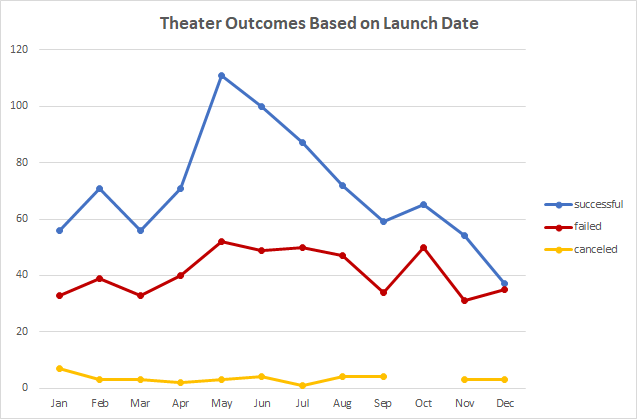
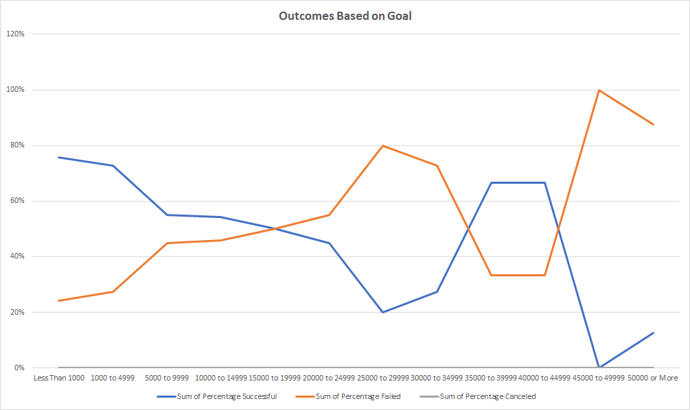

# Kickstarting with Excel:Performing Analysis on Kickstarter Data to Uncover Trends 

## Overview of Project

### Background

The dataset is a sample of Kickstarter campaigns from 2009 to 2017. It initially included the following data elements: an assigned identification number for each campaign; the name of the campaign; a short blub explaining what the campaign involved; the funding goal of each campaign by US Dollar amount; the amount of funds pledged to each campaign by US Dollar amount; the outcome of each campaign including whether it was successful, failed, canceled, or currently live; which country the campaign took place in out of 21 different countries; what currency the campaign requested out of 13 different currencies; deadline date in UNIX time, launch date in UNIX time, whether it was a staff pick or not, how many backers it had, whether it was spotlighted, and what category and subcategory of topic the campaign was for. There are 4115 rows of data of which are analyzed for general trends as per specifications identified below.

### Purpose

The purpose of this analysis is to generate a visual representation in tabular and graphical formats for the success, failure, or cancellation of theater-related Kickstarter campaigns by month of launch and for specifically play-related Kickstarter campaigns by range of funding goals. This will allow us to determine patterns of success for campaigns from being identify general trends in variance regarding the quantities of each outcome in relation to the independent variables of month of launch date or range of funding goals and/or the percentages of each outcome in relation to total number of campaigns for each of the independent variables.

## Analysis and Challenges

### Analysis of Outcomes Based on Launch Date

In the sample of theater-related Kickstarter funding campaigns, with theater selected as the category and no subcategories, there are 839 successful campaigns, 493 failed campaigns, and 37 canceled campaigns in the time period. 

We note the following total quantities of campaigns regarding campaigns launching for each month: 96 in January, 113 in February, 92 in March, 113 in April, 166 in May, 153 in June, 138 in July, 123 in August, 97 in September, 115 in October, 88 in November, and 75 in December.

The successfulness, failure, and cancellation of campaigns for each month is as follows: 56 successes, 33 failures, and 7 cancellations in January; 71 successes, 39 failures, and 3 cancellations in February; 56 successes, 33 failures, and 3 cancellations in March; 71 successes, 40 failures, and 2 cancellations in April; 111 successes, 52 failures, and 3 cancellations in May; 100 successes, 49 failures, and 4 cancellations in June; 87 successes, 50 failures, and 1 cancellation in July; 72 successes, 47 failures, and 4 cancellations in August; 59 successes, 34 failures, and 4 cancellations in September; 65 successes, 50 failures, and 0 cancellations in October; 54 successes, 31 failures, and 3 cancellations in November; and 37 success, 35 failures, and 3 cancellations in December.

Successes had a small increase upwards from January to February before falling back downwards in March. It then spiked upwards until a peak in May and steadily fell downwards until reaching close to its initial point in September and after a small increase in October continued its decline below its initial point in January.

Failures had a small increase from January to February before falling back down in March. From March, it steadily increased, at a much smaller rate compared to successes, with a peak in May where it remained roughly consistent before falling slightly in September. It had a small spike in October before falling back down in November and then increased slightly in December.

Cancellations remained consistent under 10 in value with only minor differences month-to-month varying between 0 and 7.

### Analysis of Outcomes Based on Funding Goal

In the sample of play-related Kickstarter funding campaigns, with plays selected as the subcategory, there are 694 successful campaigns, 353 failed campaigns, and 0 canceled campaigns in the time period. 

We note the following total quantities regarding campaigns launching for each designated range of funding goals: 186 for campaigns with goals less than $1,000, 534 for campaigns with goals equal to or greater than $1,000 and less than $5,000, 169 for campaigns with goals equal to or greater than $5,000 and less than $10,000, 72 for campaigns with goals equal to or greater than $10,000 and less than $15,000, 24 for campaigns with goals equal to or greater than $15,000 and less than $20,000, 20 for campaigns with goals equal to or greater than $20,000 and less than $25,000, 5 for campaigns with goals equal to or greater than $25,000 and less than $30,000, 11 for campaigns with goals equal to or greater than $30,000 and less than $35,000, 6 for campaigns with goals equal to or greater than $35,000 and less than $40,000, 3 for campaigns with goals equal to or greater than $40,000 and less than $45,000, 1 for campaigns with goals equal to or greater than $45,000 and less than $50,000, and 16 for campaigns with goals greater than $50,000.

We can determine the percentages of success or failure for each range of funding goals in relation to the total number of campaigns each month. The rounded percentile breakdown of success or failure of campaigns for each range of funding goal is as follows: 76% for success and 24% for failure for campaigns with goals less than $1,000, 73% for success and 27% for failure for campaigns with goals equal to or greater than $1,000 and less than $5,000, 55% for success and 45% for failure for campaigns with goals equal to or greater than $5,000 and less than $10,000, 54% for success and 46% for failure for campaigns with goals equal to or greater than $10,000 and less than $15,000, 50% for success and 50% for failure for campaigns with goals equal to or greater than $15,000 and less than $20,000, 45% for success and 55% for failure for campaigns with goals equal to or greater than $20,000 and less than $25,000, 20% for success and 80% for failure for campaigns with goals equal to or greater than $25,000 and less than $30,000, 27% for success and 73% for failure for campaigns with goals equal to or greater than $30,000 and less than $35,000, 67% for success and 33% for failure for campaigns with goals equal to or greater than $35,000 and less than $40,000, 67% for success and 33% for failure for campaigns with goals equal to or greater than $40,000 and less than $45,000, 0% for success and 100% for failure for campaigns with goals equal to or greater than $45,000 and less than $50,000, and 13% for success and 88% for failure for campaigns with goals greater than $50,000. For the grand total, the percentage of success and failure are 66% and 34% respectively. Noted again that these are rounded figures for cases where it appears to sum of the percentages of success and failure is not equal to 100%.

Campaigns with funding goals less than $1,000 start out a high rate of success of the vast majority of campaigns, roughly three-quarters, before trending downwards continuously until reaching campaigns with funding goals of between $25,000 and $28,999 where only a fifth succeeded. From there, rates of success increase slightly for the next $5,000 range and then spike upwards between $35,000 and $39,999 where roughly two-thirds succeeded where it remained consistent for the next $5,000 range as well. It collapsed to 0 successes at the $45,000 to $49,999 range before increasing slightly for campaigns above $50,000 at under one-fifth rate of success. The converse is true for failed campaigns given it is the only other option for campaigns.

### Challenges and Difficulties Encountered

A challenge I faced was discerning a noticeable pattern that can be interpreted from viewing the successfulness, failures, and cancellation of theater-related campaigns by month. There were months where both success and failure increased by quantity and could be explained by a larger total number of campaigns by month-to-month rather than variance in likeliness of outcome by month as a result of an effect of timing of launch dates in of itself. I overcame this challenge by conducting further analysis assessing the percentages of success, failure, and cancellation in relation to total campaigns per month to determine that months often vary in likeliness of outcome on a month-to-month basis.

## Results

### Conclusions Regarding Outcomes Based on Launch Date

From the values of the quantities of successes, failures, and cancellations, we can determine, with further analysis, the percentages of success, failure, or cancellation for each month in relation to the total number of campaigns each month. The rounded percentile breakdown of success, failure, and cancellation of campaigns for each month is as follows: 58% for success, 34% for failure, and 7% for cancellation in January; 63% for success, 35% for failure, and 3% for cancellation in February; 61% for successes, 36% for failure, and 3% for cancellation in March; 63% for successes, 35% for failure, and 2% for cancellation in April; 67% for success, 31% for failure, and 2% for cancellation in May; 65% for success, 32% for failure, and 3% for cancellation in June; 63% for success, 36% for failure, and 1% for cancellation in July; 59% for success, 38% for failure, and 3% cancellation in August; 61% for success, 35% for failure, and 4% for cancellation in September; 57% for success, 43% for failure, and 0% for cancellation in October; 61% for success, 35% for failure, and 3% for cancellation in November; and 49% for success, 47% for failure, and 4% cancellation in December. For all campaigns, the percentages of success, failure, and cancellation are 61%, 36%, and 3% respectively. Noted again that these are rounded figures for cases where it appears to sum of the percentages of success and failure is not equal to 100%.

For the reported period, we can conclude that May has the highest rate of success for Kickstarter campaigns related to theater, at 67%, and would likely be the best month to begin a campaign for theater. We can also conclude that December has the lowest rate of success for Kickstarter campaigns related to theater, at 49%, and would be the worst month to begin a campaign for theater. What can also be surmised is that warmer months, such as spring and summertime, generally have higher rates of successful campaigns while cooler months, such as autumn and wintertime generally has lower rates of successful campaigns after obtaining an average for each three-month seasonal period. This can also be determined by the monthly average of successful campaigns per month for by percentage, 61%, for the reported period and the generally negative variance from the mean in the cooler months and the comparative positive variance from the mean in the warmer months. We can also note that there is generally little likelihood for cancellation.

### Conclusions Regarding Outcomes Based on Funding Goal

In the sample of play-related Kickstarter funding campaigns, we can conclude that the campaigns by funding goal with the highest percentage of success is less than $1,000 funding campaigns at 76%. We can also conclude that the campaigns by funding goal with the lowest rate of success is equal to or greater than $45,000 and less than $50,000 funding campaigns at 0%. What can also be surmised is that campaigns with larger goals have a generally lower rate of success with the exemption of the category of all those above $50,000 which is a more inclusive category than just a range of $5,000 but could also influence larger donors to donate and the two ranges of $35,000 to $40,000 and $40,000 to $44,999 which could be due to the low sample size. What also can be concluded is that the majority of play-related Kickstarter campaigns require little funding with 18% of campaigns having funding goals being less than $1,000 and 51% of campaigns having funding goals between $1,000 and less than $5,000.

## Limitations of Dataset

One limitation to the dataset is the range of Kickstarter campaigns where the earliest year for campaigns is 2009 and the latest year for campaigns is 2017. Kickstarter began as a platform in 2009 but there has been 5 years’ worth of campaigns since the latest available datapoint. A second limitation of granularity where campaigns of the same category and subcategory could have lower-level taxonomic differences pertinent to determining their success or failures. A third limitation could be the relative value of money at different time periods given changes in price level from inflation or deflation and income level of donors from changes in income due to fluctuations in economy. A fourth limitation is the lack of metrics on who the donors are and if there are changes regarding the social groups or income levels of donors. A fifth limitation of the dataset is a lack of a data element for note the date that successful campaigns were able to meet their funding goal which can help determine if an amount of time is required to meet campaign goals.

## Other Possible Tables and/or Graphs

One possible table or graph we can create is success, failure, or canceled campaigns by length of time of the campaign between the launch date and deadline. Another table or graph could be success, failure, or canceled campaign based on number of backers or by specified ranges of the number of backers. Another table or graph that can be created is success, failure, or canceled based on whether the campaign was spotlighted by Kickstarter. Another possible table or graph that can be created is success, failure, or cancellation based on which year. Another possible table or graph can be success, failure, or cancellation by country. Each of these can be done without filtering or filtered based on another data element.
